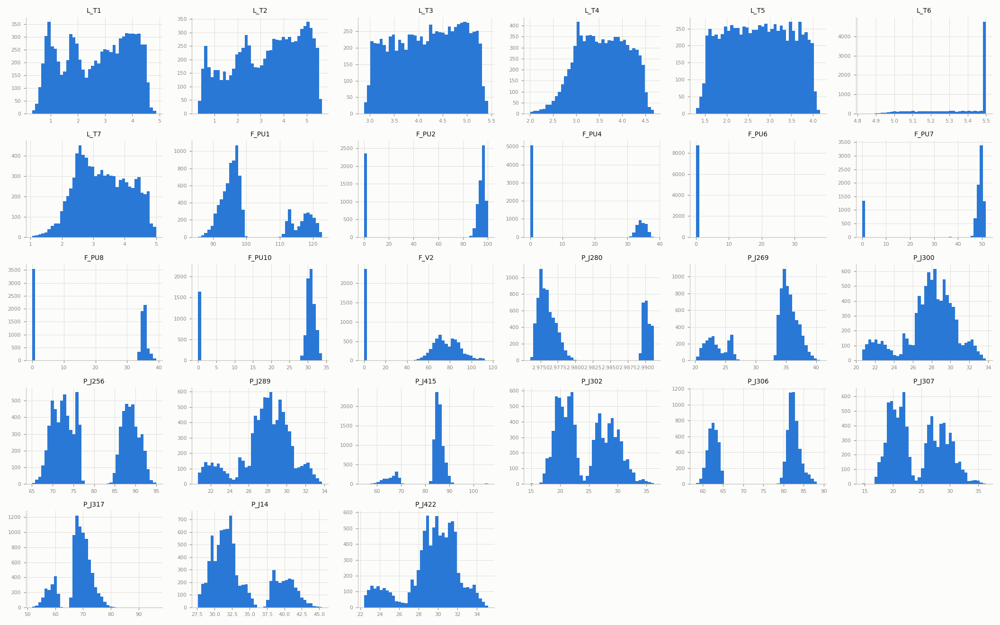
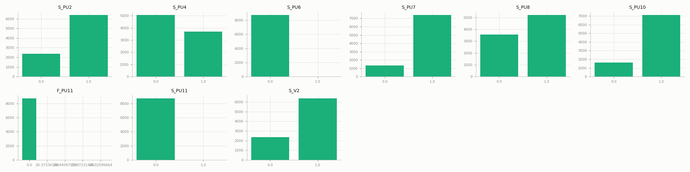
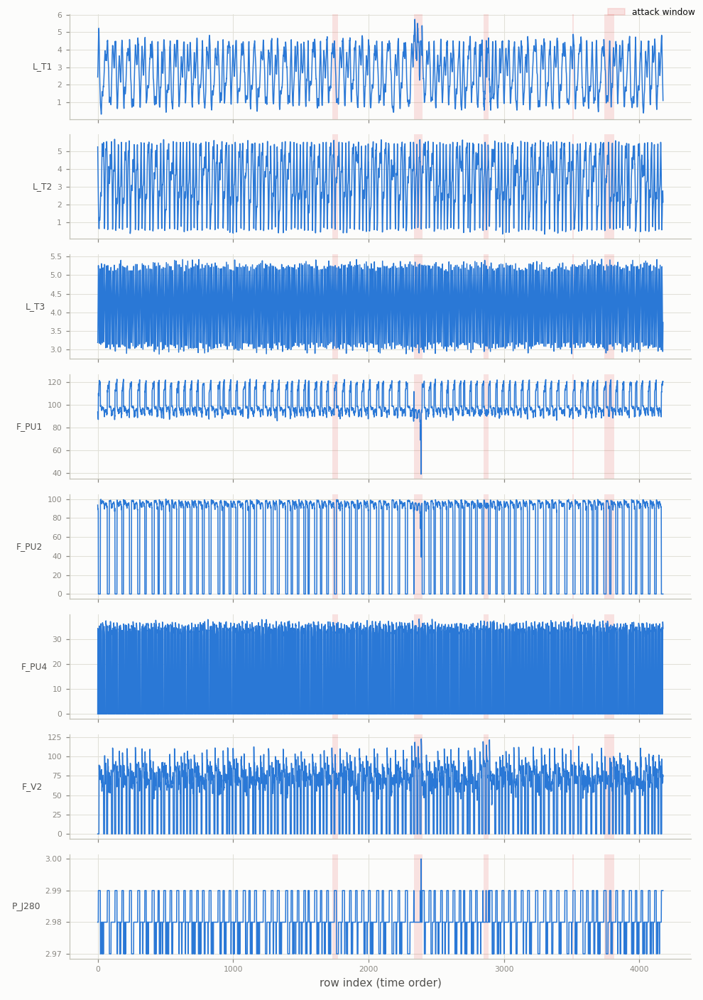
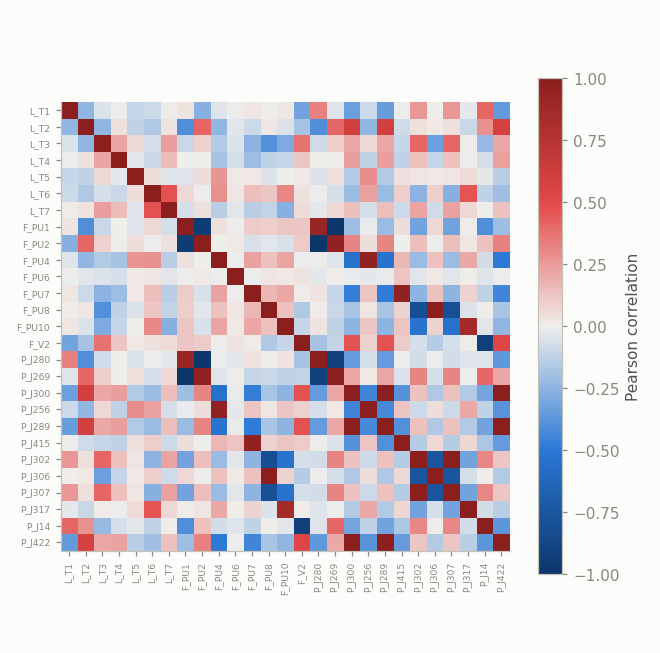
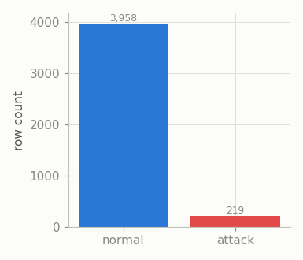
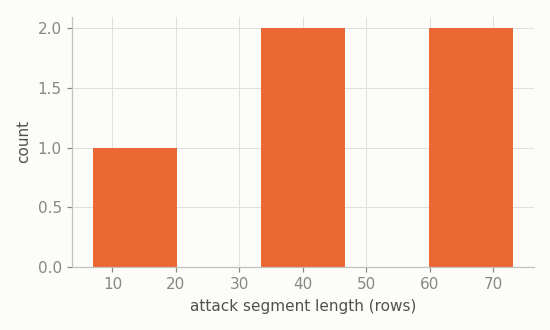
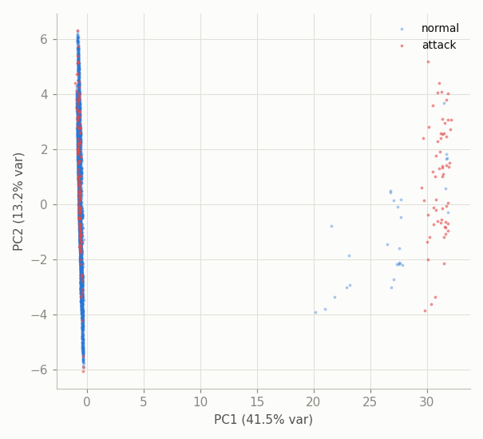

# BATADAL — Exploratory Data Analysis

BATADAL (BATtle of the Attack Detection ALgorithms): SCADA data from the C-Town water distribution network testbed (EPANET simulation), hourly readings. Source: `datasets/raw/batadal/batadal/BATADAL_dataset0{3,4}.csv`. See [`docs/cdt.md`](cdt.md) / [`docs/pbnn.md`](pbnn.md) / [`docs/cnn1d.md`](cnn1d.md) for how this feeds the three methods.

## Overview

- `BATADAL_dataset03.csv`: 8,761 rows, ~1 year hourly, entirely normal operation (train).
- `BATADAL_dataset04.csv`: 4,177 rows, ~6 months hourly, contains 7 documented attacks (test).
- Raw tag count: 43 (before dropping constant columns).
- After cleaning: train 8,761 rows, test 4,177 rows, 36 non-constant tags (27 continuous, 9 discrete/actuator).
- Test-set attack rate: 5.24% (219 / 4,177 rows).
- Timestamp format example: `06/01/14 00` (hourly sampling, much coarser than SWaT/WADI/HAI's ~1Hz).
- The original competition's held-out test set (`BATADAL_test_dataset.zip`) ships with no label column at all and isn't used here -- see `src/data/batadal.py`.

## Data quality (raw files)

Columns with any missing values in `dataset03.csv`: 0 / 43.

Constant (or single-valued) columns dropped by the loader: F_PU3, F_PU5, F_PU9, S_PU1, S_PU3, S_PU5, S_PU9.

Label column (`ATT_FLAG`) values -- `dataset03.csv`: {0: 8761}; `dataset04.csv`: {-999: 3958, 1: 219}. There is no explicit `0` in `dataset04.csv` -- only confirmed attacks are marked `1`, everything else is `-999` ("not confirmed either way"), treated here as normal (0), the standard convention for this dataset.

## Univariate distributions

All 27 continuous sensors, training period (attack-free):

All 9 discrete actuator/state columns, training period:

## Temporal structure

A handful of representative tags (tank levels, pump flows, valve flow, junction pressure) across the full test period, downsampled for plotting; shaded bands are attack windows:

## Correlation structure

Top 10 most correlated sensor pairs (training period):

|     | var_a   | var_b   |   correlation |
|----:|:--------|:--------|--------------:|
| 337 | P_J302  | P_J307  |         1     |
| 169 | F_PU1   | P_J269  |        -1     |
| 307 | P_J300  | P_J289  |         1     |
| 329 | P_J289  | P_J422  |         0.997 |
| 314 | P_J300  | P_J422  |         0.996 |
| 186 | F_PU2   | P_J280  |        -0.993 |
| 255 | F_PU8   | P_J306  |         0.99  |
| 206 | F_PU4   | P_J256  |         0.956 |
| 239 | F_PU7   | P_J415  |         0.954 |
| 187 | F_PU2   | P_J269  |         0.95  |

## Class balance & attack segments

- 5 contiguous attack segments (BATADAL's own documentation describes 7 attacks in this file; segment count may differ slightly if attacks are adjacent/back-to-back in hourly resolution).
- Segment length -- mean 44, median 42, max 73 rows (hours, given hourly sampling).

## Separability projection (PCA)

*4,177-row sample (all of dataset04, given its size); standardized using training-period mean/std.*

## BATADAL-specific notes

- Tags: `L_T*` tank levels, `F_PU*`/`S_PU*` pump flow/status pairs, `F_V2`/`S_V2` valve flow/status, `P_J*` junction pressures.
- Hourly sampling is far coarser than SWaT/WADI/HAI's ~1Hz -- a year of data is only ~8,760 rows, much less than the other ICS datasets' millions.
- 7 constant column(s) in the raw data were dropped before modeling.
- `CTOWN.INP` (the EPANET network topology model) ships alongside the CSVs but isn't parsed as a ground-truth graph here -- same category of gap as HAI's boiler graph (node ids would need a translation layer to the SCADA tags above).
