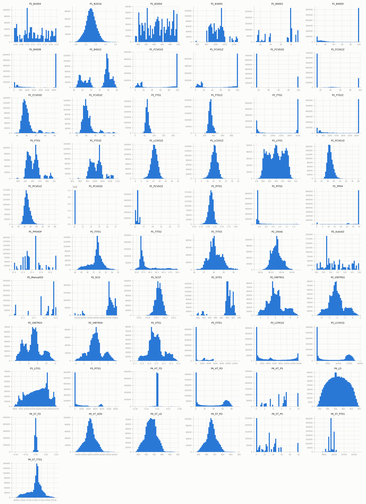
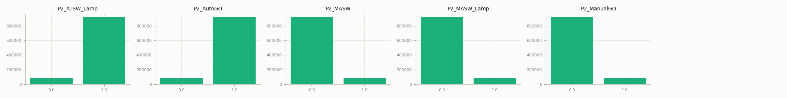
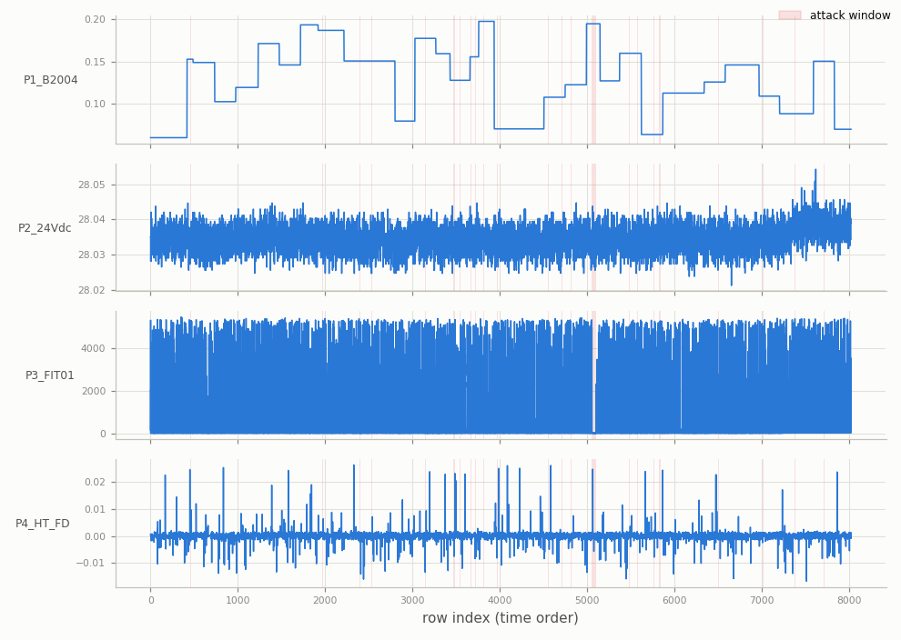
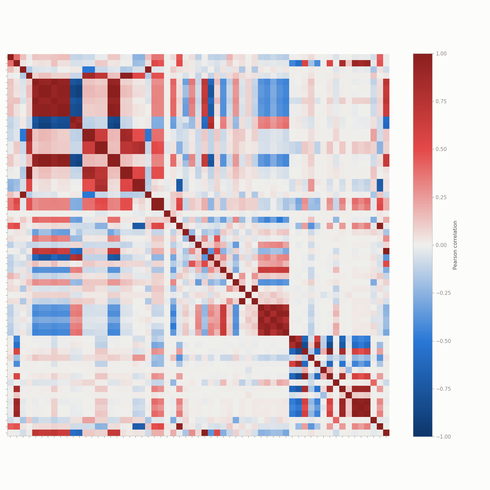
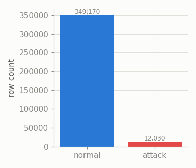
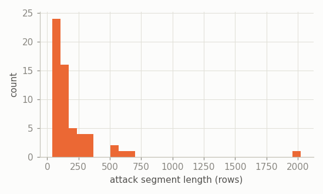
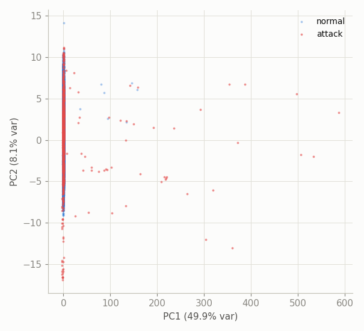
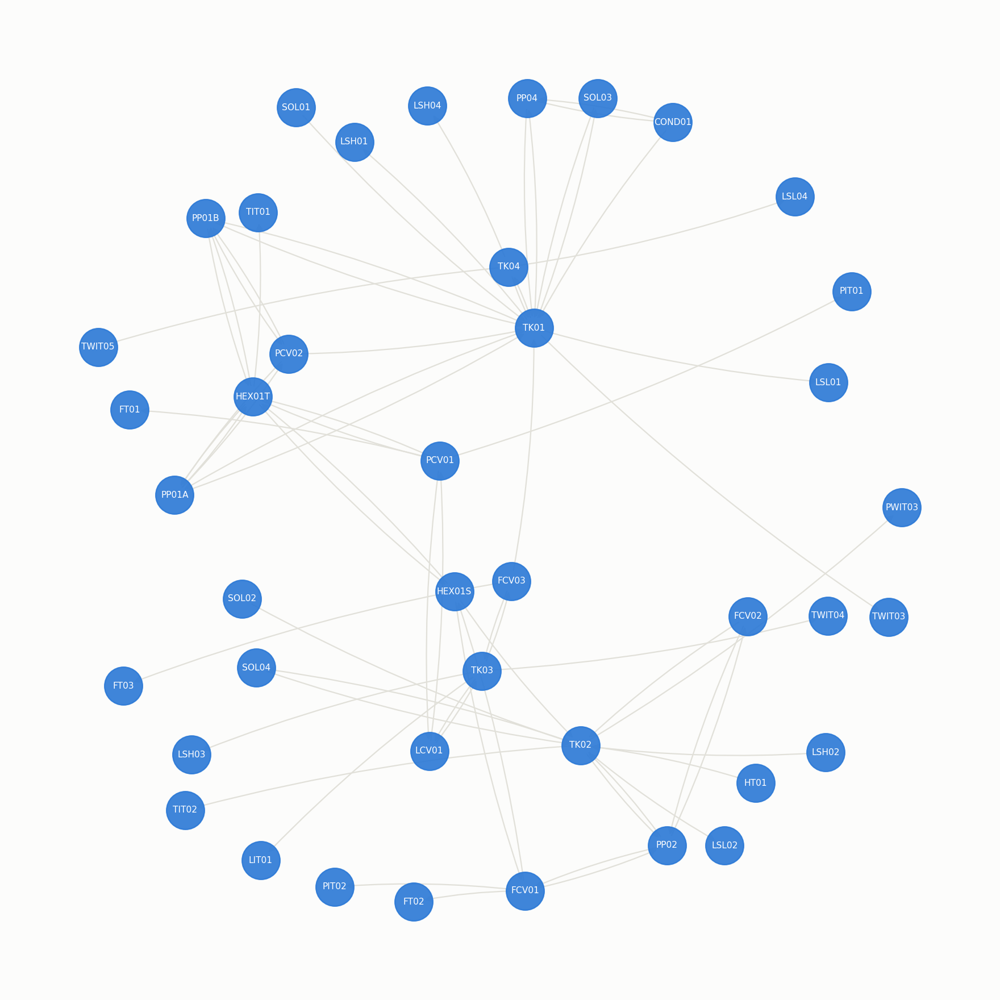

# HAI — Exploratory Data Analysis

HIL-based Augmented ICS (HAI) testbed data, version `hai-22.04`: a combined boiler/turbine/water-treatment process, ~1 reading/second. Source files: `datasets/raw/hai/hai-22.04/train*.csv` (6 files) and `test*.csv` (4 files), each already carrying an inline `Attack` label (unlike HAI 23.05, which needs a separate label file joined on timestamp -- see `src/data/hai.py`). See [`docs/cdt.md`](cdt.md) / [`docs/pbnn.md`](pbnn.md) for how this feeds the two methods.

## Overview

- Train files (train1.csv, train2.csv, train3.csv, train4.csv, train5.csv, train6.csv): 1,004,402 rows total, all labeled `Attack=0` in the source (`0` non-zero found).
- Test files (test1.csv, test2.csv, test3.csv, test4.csv): 361,200 rows total, `Attack=1` for 12,030 rows.
- Raw tag count: 86 (before dropping constant columns).
- After cleaning: train 1,004,402 rows, test 361,200 rows, 66 non-constant tags (61 continuous, 5 discrete).
- Test-set attack rate: 3.33% (12,030 / 361,200 rows).
- Other HAI versions available but not used here: 20.07, 21.03, 23.05 (23.05 needs the separate-label-file join mentioned above).

## Data quality (raw files)

Columns with any missing values across all 6 train files: 0 / 86 -- HAI's raw data is complete, unlike WADI's.

5 non-1-second timestamp jump(s) in the concatenated train files -- exactly the 5 boundaries between the 6 separately-recorded train files stitched together here, not a real data gap (contrast with WADI's genuine mid-collection outage).

Constant columns dropped by the loader: 18 (e.g. P1_PIT01_HH, P1_PP01AD, P1_PP01AR, P1_PP01BD, P1_PP01BR, P1_PP02D, P1_PP02R, P1_SOL01D...).

## Univariate distributions

All 61 continuous sensors, training period:

All 5 discrete/binary columns, training period:

## Temporal structure

One representative continuous tag per process subsystem (P1, P2, P3, P4), across the full test period, downsampled for plotting; shaded bands are attack windows:

## Correlation structure

Top 10 most correlated sensor pairs (training period):

|      | var_a     | var_b      |   correlation |
|-----:|:----------|:-----------|--------------:|
|  452 | P1_FCV01D | P1_FCV01Z  |         1     |
|  355 | P1_B400B  | P1_FT02Z   |         1     |
| 1816 | P4_ST_GOV | P4_ST_PO   |         0.999 |
| 1423 | P1_TIT01  | P4_ST_TT01 |         0.999 |
| 1742 | P3_LCV01D | P4_HT_PO   |         0.999 |
|  301 | P1_B4005  | P1_FT02Z   |         0.998 |
|  290 | P1_B4005  | P1_B400B   |         0.998 |
|  927 | P1_FT03   | P1_FT03Z   |         0.996 |
|  749 | P1_FT01   | P1_FT01Z   |         0.996 |
| 1555 | P2_SCO    | P2_SIT01   |         0.995 |

## Class balance & attack segments

- 58 contiguous attack segments.
- Segment length -- mean 207, median 148, max 2025 rows.

## Separability projection (PCA)

*50,000-row sample; standardized using training-period mean/std.*

## Ground-truth boiler causal graph

41 nodes, 67 directed edges (`datasets/raw/hai/graph/boiler/phy_boiler.json`). **Node-id overlap with this dataset's 66 tag columns: 0** -- the graph uses physical-component ids (`TK01`, `PP01A`, ...) while the CSV columns use DCS tag names (`P1_LIT01`, ...), so this graph cannot be used directly for structural-accuracy scoring against a discovered graph over these columns (see `src/data/hai.py` and `src/metrics/graph.py`); it's included here for topology reference only.

## HAI-specific notes

- Tags are prefixed by process subsystem (`P1`-`P4`).
- 18 constant column(s) in the raw data were dropped before modeling.
- Using version `hai-22.04` for consistency with the benchmark harness default; other versions differ in label convention and would need separate EDA if used.
