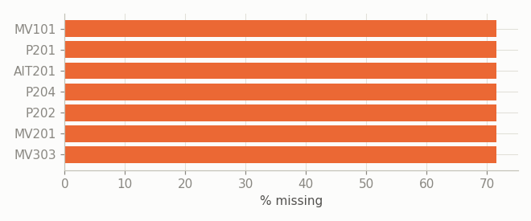
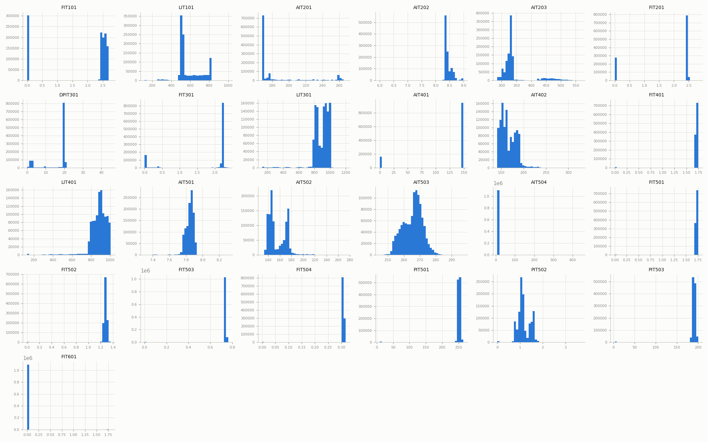
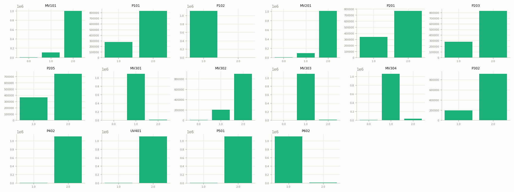
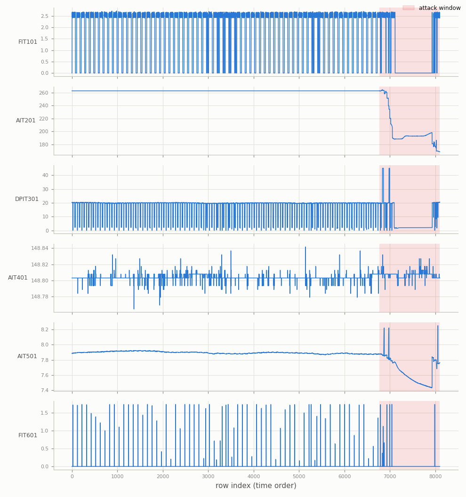
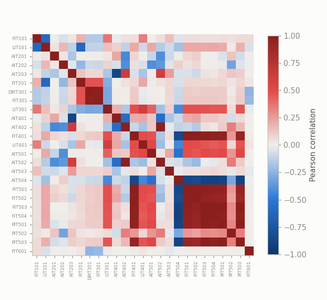
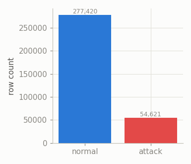
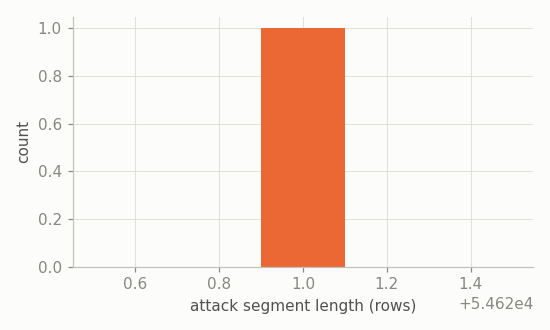
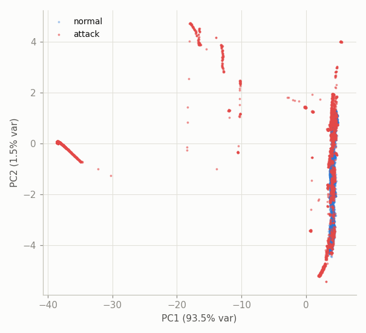

# SWaT — Exploratory Data Analysis

Secure Water Treatment (SWaT) testbed data: a 6-stage water treatment process, ~1 reading/second. Source files: `datasets/raw/swat/normal.csv`, `attack.csv`. See [`docs/cdt.md`](cdt.md) and [`docs/pbnn.md`](pbnn.md) for how this feeds the two methods, and the root [`README.md`](../README.md#known-caveats-see-the-method-docs-for-the-full-list) for why the train/test split isn't the shipped `merged.csv`.

## Overview

- `normal.csv`: 1,387,098 rows -- entirely labeled Normal.
- `attack.csv`: 54,621 rows -- entirely labeled Attack (a paper-specific extraction of attack windows, not the canonical mixed test period).
- Raw tag count: 51 (before dropping constant columns).
- After cleaning + leak-free split: train 1,109,678 rows, test 332,041 rows, 41 non-constant tags (25 continuous, 16 discrete/actuator).
- Test-set attack rate: 16.45% (54,621 / 332,041 rows).
- Timestamp format example: ` 28/12/2015 10:00:00 AM` (~1 Hz sampling).

## Data quality (raw files)

Columns with any missing values in `normal.csv`: 7 / 51.

Constant (or single-valued) columns dropped by the loader: P202, P206, P301, P401, P403, P404, P502, P601, P603.

Label column values -- `normal.csv`: {'Normal': 1387098}; `attack.csv`: {'Attack': 54621} (no label typos/variants found).

## Univariate distributions

All 25 continuous sensors, training period (attack-free):

All 16 discrete actuator/state columns, training period:

## Temporal structure

One representative tag per process stage (P1-P6), across the full test period (normal + attack), downsampled for plotting; shaded bands are attack windows:

## Correlation structure

Top 10 most correlated sensor pairs (training period):

|     | var_a   | var_b   |   correlation |
|----:|:--------|:--------|--------------:|
| 295 | PIT501  | PIT503  |         0.998 |
| 214 | FIT401  | FIT501  |         0.995 |
| 286 | FIT503  | PIT501  |         0.993 |
| 285 | FIT503  | FIT504  |         0.99  |
| 288 | FIT503  | PIT503  |         0.985 |
| 272 | FIT501  | FIT502  |         0.984 |
| 215 | FIT401  | FIT502  |         0.979 |
| 198 | AIT402  | AIT502  |         0.979 |
| 129 | DPIT301 | FIT301  |         0.975 |
| 273 | FIT501  | FIT503  |         0.975 |

## Class balance & attack segments

- 1 contiguous attack segment(s) -- with only 1 segment, this is an artifact of the test set being held-out-normal followed by all of `attack.csv` back-to-back (see Overview), not evidence that real attacks are one long uninterrupted window.
- Segment length -- mean 54621, median 54621, max 54621 rows.

## Separability projection (PCA)

*50,000-row stratified-by-time sample; standardized using training-period mean/std.*

## SWaT-specific notes

- 6 process stages (P1 raw water intake -- P6 backwash), tags numbered `<TYPE><stage><id>` e.g. `FIT101` = flow sensor, stage 1.
- The leak-free train/test split holds out a tail slice of `normal.csv` for testing rather than reusing rows also used to fit the model -- see `src/data/swat.py`.
- 9 constant column(s) in the raw data were dropped before modeling.
