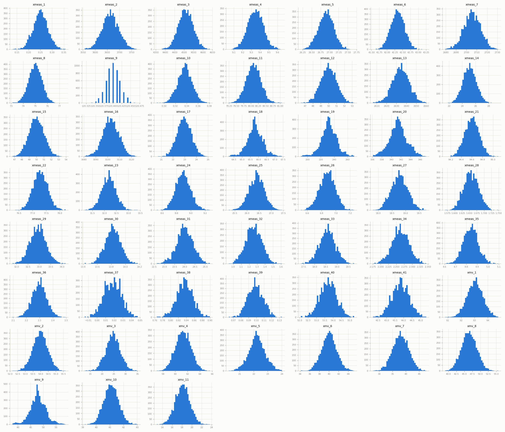
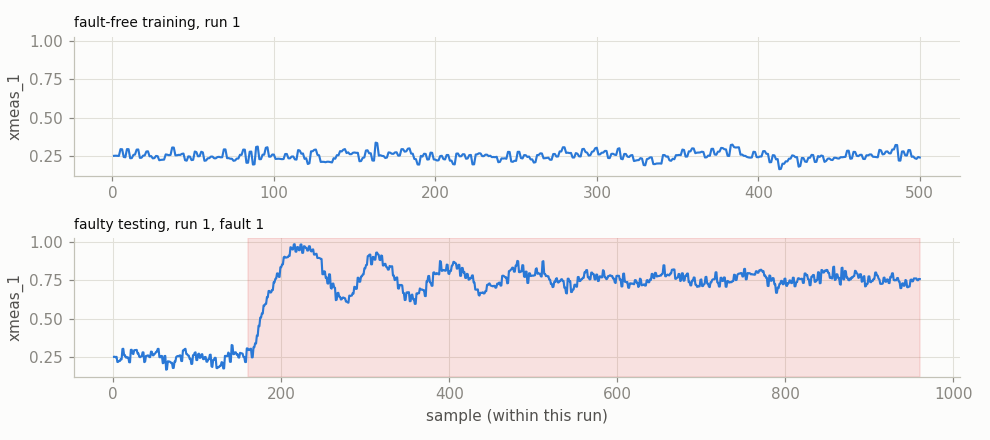
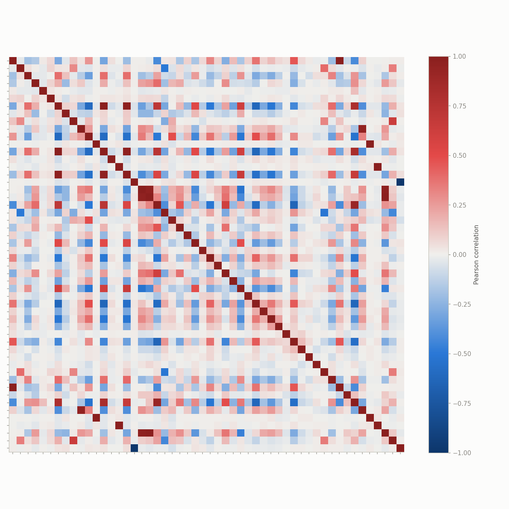
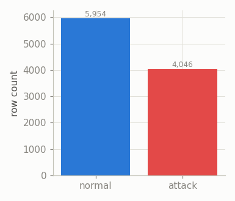
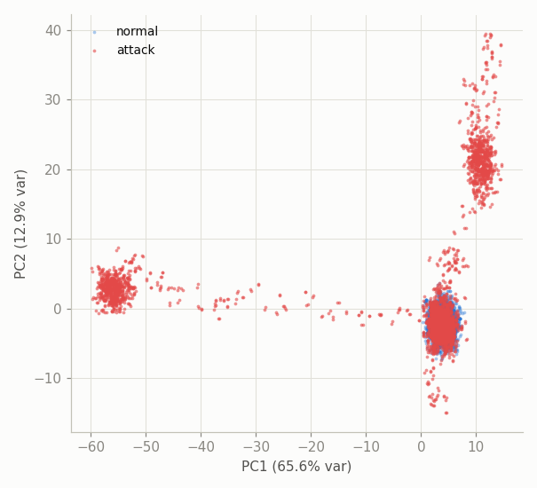

# TEP — Exploratory Data Analysis

Tennessee Eastman Process (TEP), Rieth et al. 2017 simulation release: a chemical process simulation, sampled every 3 minutes. Source: `datasets/raw/tep/tep_files/*.parquet` (converted from the original RData via `scripts/build_tep_parquet.py`). Unlike every other dataset here, TEP is organized as **many independent short simulation runs** (500 samples/25h training, 960 samples/48h testing) across 21 conditions (0=normal, 1-20=distinct fault types) rather than one continuous recording -- see `src/data/tep.py`'s module docstring for how this becomes one binary normal/anomaly `ICSDataset` (all 20 faults merged, per the user's choice).

## Overview

**This report ran with `--nrows 5000`** (a per-file row cap, not the full dataset) -- an uncapped run OOM-killed this environment in practice, so the numbers below reflect a small slice, not TEP's actual full scale (nominally 500 runs x 500/960 samples x 21 conditions -- see the source-file row counts quoted below for what was *actually* read here). Re-run with `--nrows 0` on a machine with plenty of spare RAM for the real report.

- Fault-free training: 5,000 rows read (capped at --nrows 5000).
- Fault-free testing: 5,000 rows read (capped at --nrows 5000).
- Faulty testing: 5,000 rows read (capped at --nrows 5000) -- **`faulty_training` (~5M rows) is never used**, since every method here trains on fault-free data only (not even extracted, see `scripts/build_tep_parquet.py`).
- 52 process variables (41 `xmeas_*` measured + 11 `xmv_*` manipulated), all continuous -- 52/52 after cleaning, 0 discrete.
- After cleaning: train 5,000 rows, test 10,000 rows.
- Test-set attack (fault) rate: 40.46% (4,046 / 10,000 rows).
- Sample rate: one reading every 3 minutes (much coarser than SWaT/WADI/HAI's ~1Hz, coarser even than BATADAL's hourly rate is dense-per-day, but each run only spans 25-48 simulated hours).

## Data quality (raw files)

Columns with any missing values in fault-free training: 0 / 52 -- a clean simulated dataset, unlike the real ICS datasets.

Constant columns dropped by the loader: none.

Fault labeling within `faulty_testing`: per the dataset's own documentation, faults are introduced 160 samples (8 hours) into each faulty run -- rows before that point are labeled 0 (still genuinely fault-free) even though the run's `faultNumber` is already nonzero. Confirmed directly: first faulty run's samples 1-159 are labeled 0, sample 160 onward is labeled 1.

Concatenating 500+ independent runs end-to-end creates artificial "seams" at every run boundary (a discontinuous jump in process state) -- inherent to this data's shape, not a cleaning artifact; see "Temporal structure" below for what a single real run actually looks like.

## Univariate distributions

All 52 continuous process variables, training period (fault-free):

## Temporal structure

One real run, not the flattened multi-run table: `xmeas_1` (a measured variable) for fault-free run 1 (training) vs. faulty run 1 (fault 1, testing) -- shaded band marks the post-fault-introduction period (sample >= 160):

## Correlation structure

Top 10 most correlated variable pairs (training period):

|     | var_a    | var_b    |   correlation |
|----:|:---------|:---------|--------------:|
| 541 | xmeas_12 | xmv_7    |         1     |
| 656 | xmeas_15 | xmv_8    |         1     |
| 730 | xmeas_17 | xmv_11   |        -0.999 |
| 296 | xmeas_7  | xmeas_13 |         0.998 |
|  42 | xmeas_1  | xmv_3    |         0.997 |
| 795 | xmeas_19 | xmv_9    |         0.989 |
| 762 | xmeas_18 | xmv_9    |         0.976 |
| 299 | xmeas_7  | xmeas_16 |         0.971 |
| 548 | xmeas_13 | xmeas_16 |         0.962 |
| 731 | xmeas_18 | xmeas_19 |         0.959 |

## Class balance & fault segments

- 6 contiguous "fault" segments -- with 500 runs x 20 fault types, expect this to be large and fairly uniform (each faulty run contributes one segment of ~800 samples, by construction).
- Segment length -- mean 674, median 801, max 801 samples.

## Separability projection (PCA)

*10,000-row sample covering 6 of 20 fault types present in this run's data (dominant faults may visually crowd out subtler ones; a small --nrows cap covers fewer fault types, since faulty_testing is ordered fault-ascending); standardized using training-period mean/std.*

## TEP-specific notes

- All 20 fault types are merged into one binary label here -- some are far easier to detect than others in the TEP literature (e.g. fault 1/step changes vs. fault 3/19, notoriously hard); a per-fault breakdown would need the 20-separate-datasets alternative noted in `src/data/tep.py`, not built here.
- Every method in this harness trains on fault-free data only, so `faulty_training` is never extracted or used -- only `fault_free_training`, `fault_free_testing` and `faulty_testing` are.
- 0 constant column(s) in the raw data were dropped before modeling.
- Full-scale `test` is ~10.1M rows -- about 7x SWaT's full dataset -- and an uncapped EDA run OOM-killed this environment in practice; see the capped-run notice at the top of this report for what was actually analyzed here. Benchmark runs should use `--nrows` for the same reason (see root README's Performance section).
