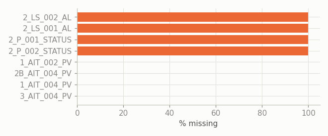
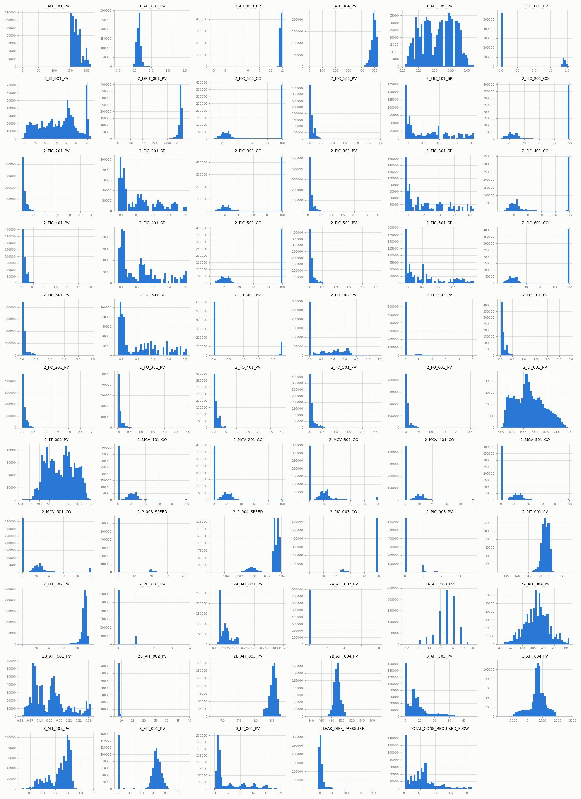
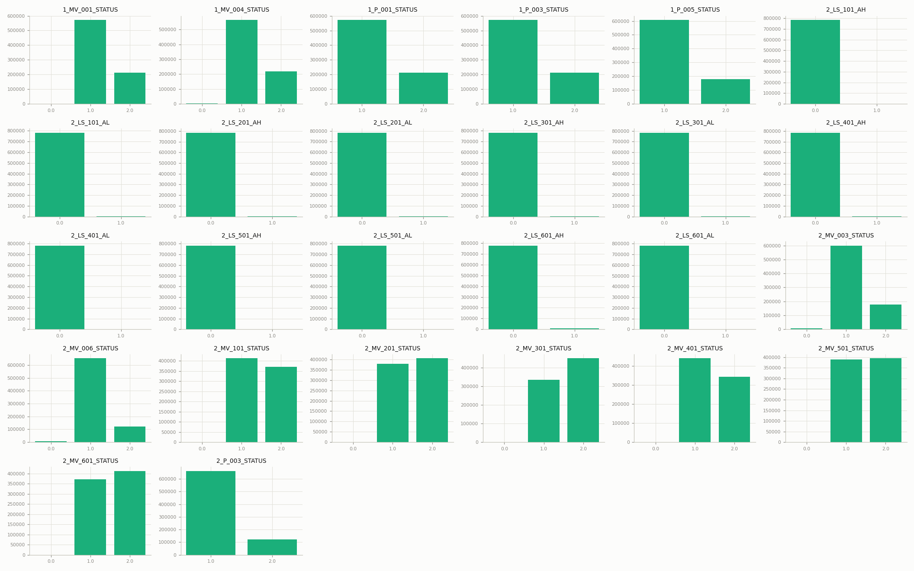
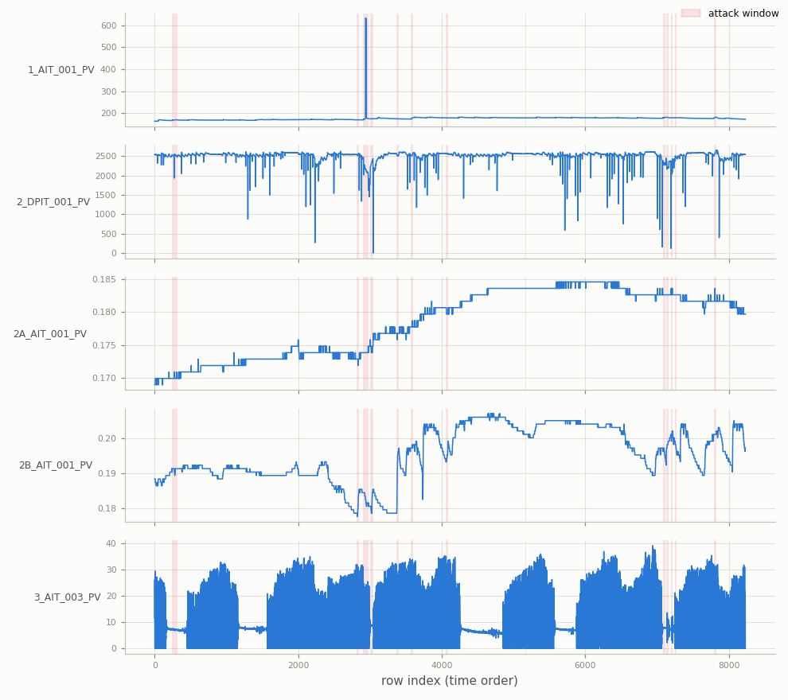
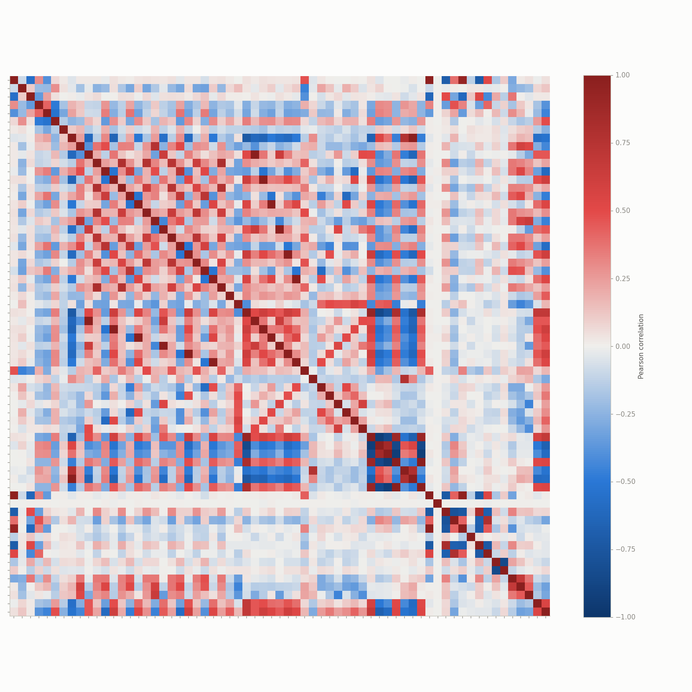
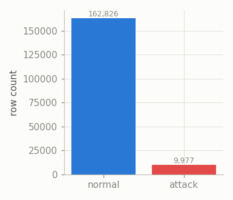
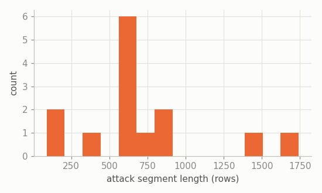
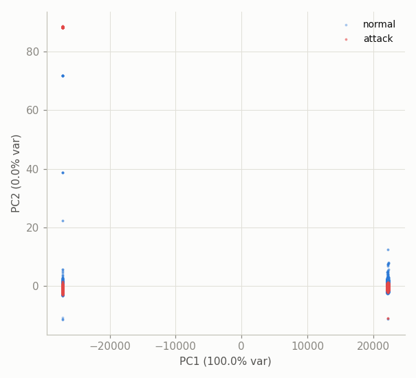

# WADI — Exploratory Data Analysis

Water Distribution (WADI) testbed data: a water distribution network downstream of SWaT, ~1 reading/second. Source files: `datasets/raw/wadi/WADI_14days_new.csv` (normal baseline), `WADI_attackdataLABLE.csv` (labeled attack period). See [`docs/cdt.md`](cdt.md) / [`docs/pbnn.md`](pbnn.md) for how this feeds the two methods.

## Overview

- `WADI_14days_new.csv`: 784,571 rows, normal operation, no label column.
- `WADI_attackdataLABLE.csv`: 172,803 rows, label column `Attack LABLE (1:No Attack, -1:Attack)` (1 = no attack, -1 = attack).
- Raw tag count: 127 (before dropping constant/empty columns).
- After cleaning: train 784,571 rows, test 172,803 rows, 91 non-constant tags (65 continuous, 26 discrete/status).
- Test-set attack rate: 5.77% (9,977 / 172,803 rows).

## Data quality (raw files)

**Date format is inconsistent within `WADI_14days_new.csv`**: 2-digit year, 4-digit year both appear (e.g. `9/25/2017` vs `10/7/17`) -- naive date parsing without a flexible parser will silently misinterpret or fail on part of the file.

**1 discontinuity(ies) in the `Row` index totaling 264,000 missing rows** (25.2% of the nominal 1 Hz timeline) -- the largest is a gap of 264,000 rows (~73.3 hours) between Row 335,999 and 600,000. This is a real mid-collection outage in the normal/training period, not a plotting artifact: any model treating this file as one continuous time series should account for the discontinuity rather than bridging across it.

Columns with any missing values: 8 / 127, of which 4 are **entirely empty** in this file: 2_LS_001_AL, 2_LS_002_AL, 2_P_001_STATUS, 2_P_002_STATUS.

Constant columns dropped by the loader (includes the fully-empty ones above, since all-NaN counts as a single unique value): 34.

## Univariate distributions

All 65 continuous sensors, training period:

All 26 discrete status/alarm columns, training period:

## Temporal structure

One representative continuous tag per subsystem (1, 2, 2A, 2B, 3), across the full test period, downsampled for plotting; shaded bands are attack windows:

## Correlation structure

Top 10 most correlated sensor pairs (training period):

|      | var_a         | var_b         |   correlation |
|-----:|:--------------|:--------------|--------------:|
| 1145 | 2_FIC_501_PV  | 2_FQ_501_PV   |         0.999 |
|  719 | 2_FIC_201_PV  | 2_FQ_201_PV   |         0.999 |
|  870 | 2_FIC_301_PV  | 2_FQ_301_PV   |         0.999 |
| 1269 | 2_FIC_601_PV  | 2_FQ_601_PV   |         0.999 |
| 1911 | 2_PIC_003_PV  | 2_PIT_003_PV  |         0.999 |
| 1012 | 2_FIC_401_PV  | 2_FQ_401_PV   |         0.999 |
|  559 | 2_FIC_101_PV  | 2_FQ_101_PV   |         0.999 |
|  467 | 2_DPIT_001_PV | 2_PIT_002_PV  |         0.986 |
|   49 | 1_AIT_001_PV  | 2A_AIT_001_PV |         0.969 |
| 1978 | 2A_AIT_001_PV | 2B_AIT_001_PV |         0.965 |

## Class balance & attack segments

- 14 contiguous attack segments.
- Segment length -- mean 713, median 651, max 1741 rows.

## Separability projection (PCA)

*50,000-row sample; standardized using training-period mean/std.*

## WADI-specific notes

- Tags are prefixed by subsystem number (`1_`, `2_`, `2A_`, `2B_`, `3_`) and suffixed by signal type (`_PV` process value, `_STATUS`, `_AL` alarm, `_CO` control output, `_SP` setpoint).
- 34 constant/empty column(s) in the raw data were dropped before modeling.
- The attack file's label column is `"Attack LABLE (1:No Attack, -1:Attack)"` -- note the embedded newline in the source header and the sic'd spelling; `src/data/wadi.py` selects it positionally rather than by exact name.
