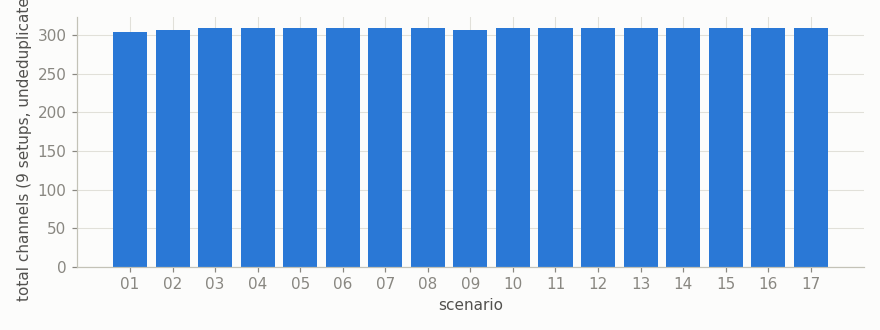
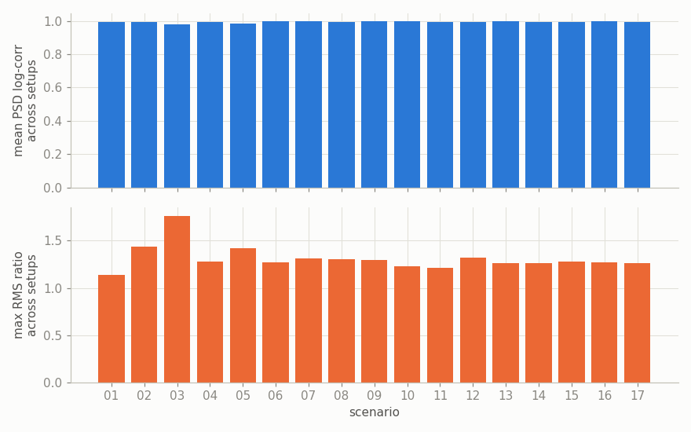
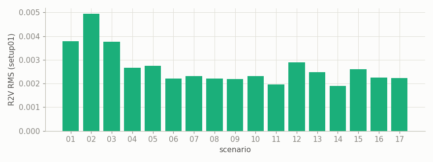
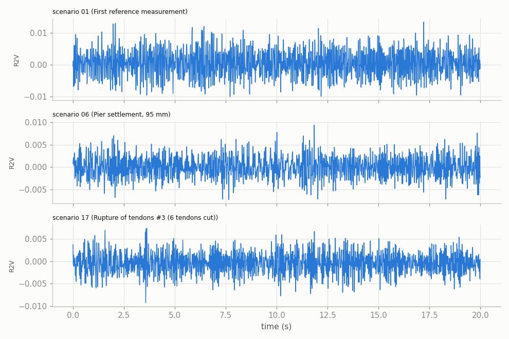
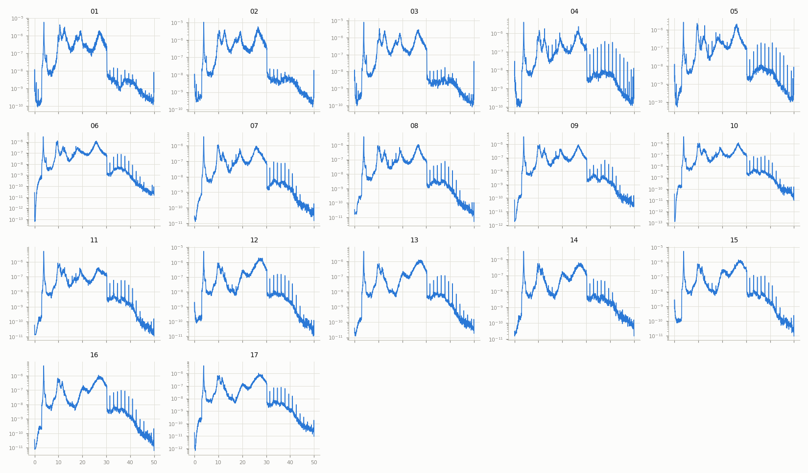
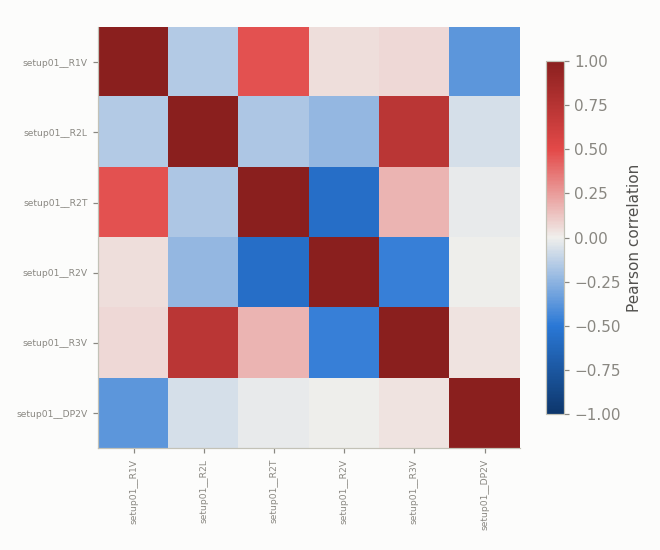

# Z24 Bridge (PDT) — Exploratory Data Analysis

Z24 Bridge Progressive Damage Test (PDT) campaign: 17 discrete, mostly-irreversible structural damage scenarios applied to a real bridge in 1998 before demolition, each measured with a forced-vibration test (shaker excitation). Source: `datasets/data-z24/pdt_*.zip`. Unlike SWaT/WADI/HAI, there is **no continuous time series or binary attack label** here -- each scenario is its own labeled structural state. Benchmark/method integration is deferred; see `src/data/z24.py` for how each scenario's 9 forced-vibration setups were combined into one file (setup-prefixed columns, e.g. `setup01__R2V`).

## Overview

- 17 scenarios, 9 forced-vibration setups combined into each (153 source `.mat` files total).
- Sample rate: 100 Hz. Samples per scenario: 65,530-65,536 (~655-655s).
- Total channels per scenario (9 setups x 28-35 channels each, not deduplicated): 304-309.
- 2 scenario(s) have an **inferred rather than confirmed** label (see Scenario notes below): 03, 17.

## Data quality

Documented sample count is 65536 (Appendix J); actual per-scenario sample count (after truncating each scenario's 9 setups to their common length) is 65536 for 15 scenarios, but only 65530 for scenario(s) 01, 02 -- a small, consistent trim, cause not documented in the source material.

Channel count varies by scenario (304-309) because not every setup carries every shared channel (e.g. `DP1V` is documented as lost in scenario 01's setups 01 & 05 -- confirmed directly in the data: absent in scenario 01 setup 01).

## Same-forcing consistency check

Each scenario's 9 setups share the same forcing, so the reference/driving-point channels that recur in nearly every setup should read consistently across setups *if* that assumption holds exactly. Raw time-domain correlation between setups turns out to be ~0 for these channels (confirmed: mean pairwise correlation for `R2V`/`DP2V` in scenario 01 was ~0.00) -- consistent with **stochastic (random-noise) shaker excitation**, where each setup gets a different random-noise realization rather than a repeated deterministic waveform, so sample-by-sample correlation isn't the right test. **Spectral** (PSD) correlation is the right test instead, and it's high (0.96-0.996 in spot checks) -- the excitation's statistical character, not its exact time trace, repeats across setups.

Lowest mean spectral consistency: scenario 03 (mean PSD log-correlation 0.979). Full per-scenario numbers:

|    |   scenario |   mean_psd_log_corr |   max_rms_ratio |
|---:|-----------:|--------------------:|----------------:|
|  0 |         01 |               0.995 |           1.14  |
|  1 |         02 |               0.993 |           1.437 |
|  2 |         03 |               0.979 |           1.762 |
|  3 |         04 |               0.994 |           1.276 |
|  4 |         05 |               0.986 |           1.417 |
|  5 |         06 |               0.997 |           1.274 |
|  6 |         07 |               0.997 |           1.316 |
|  7 |         08 |               0.995 |           1.306 |
|  8 |         09 |               0.997 |           1.292 |
|  9 |         10 |               0.996 |           1.227 |
| 10 |         11 |               0.995 |           1.21  |
| 11 |         12 |               0.995 |           1.321 |
| 12 |         13 |               0.996 |           1.264 |
| 13 |         14 |               0.995 |           1.265 |
| 14 |         15 |               0.994 |           1.278 |
| 15 |         16 |               0.996 |           1.272 |
| 16 |         17 |               0.993 |           1.266 |

## Vibration amplitude across scenarios

RMS amplitude of a representative shared channel (`R2V`, setup01) across all 17 scenarios -- a first-order look at whether response magnitude tracks damage progression:

## Time series

`R2V` (setup01), first 20s, for three contrasting scenarios:

## Frequency-domain analysis (PSD across all 17 scenarios)

`R2V` (setup01) power spectral density for every scenario -- natural-frequency shift with progressive damage is the standard SHM signal for this exact dataset:

## Correlation among shared channels

Within scenario 01, setup01: correlation among the 6 of 7 candidate shared channels present here (`DP1V` absent in this particular setup, per the documented channel loss noted above):

## Scenario notes

|    |   scenario | label                                                       | label_confidence   | test_date             | notes                                                                                                                                                                                                                                                                                                                                                                                                                                                  |
|---:|-----------:|:------------------------------------------------------------|:-------------------|:----------------------|:-------------------------------------------------------------------------------------------------------------------------------------------------------------------------------------------------------------------------------------------------------------------------------------------------------------------------------------------------------------------------------------------------------------------------------------------------------|
|  0 |         01 | First reference measurement                                 | confirmed          | 1998-08-04/1998-08-05 | Prior to Koppigen Pier installation (undamaged baseline, original bearings). Cabling error lost signals 223,228,233,238,243 (renamed to Utzenstorf pier); DP1V lost in setups 01 & 05; force from driving point 2 (DP2) must be multiplied by a factor of 6.25.                                                                                                                                                                                        |
|  1 |         02 | Second reference measurement                                | confirmed          | 1998-08-09/1998-08-10 | After Koppigen Pier installation (new temporary support hardware installed at Koppigen pier, still undamaged).                                                                                                                                                                                                                                                                                                                                         |
|  2 |         03 | Pier settlement, 20 mm                                      | inferred           | 1998-08-11/1998-08-12 | No test report (.DOC) present in either zip for this scenario -- label and date inferred from Appendix F's deflection progression (Level 1 = -20mm) and the chronological gap between scenario 02 (09-10 Aug) and scenario 04 (13-14 Aug, 40mm). Not a document quote.                                                                                                                                                                                 |
|  3 |         04 | Pier settlement, 40 mm                                      | confirmed          | 1998-08-13/1998-08-14 | None.                                                                                                                                                                                                                                                                                                                                                                                                                                                  |
|  4 |         05 | Pier settlement, 80 mm                                      | confirmed          | 1998-08-17/1998-08-18 | AVT report only (no FVT .DOC, though fvt/*.mat data exists). "Some strange behaviour of signals 100V,105V,110V... and so forth, 200V,205V,210V... No explanation found" (quoted from the source report).                                                                                                                                                                                                                                               |
|  5 |         06 | Pier settlement, 95 mm                                      | confirmed          | 1998-08-18/1998-08-19 | Extra raw per-channel .aaa exports exist under avt/ for this scenario (out of scope here since only fvt/ was extracted).                                                                                                                                                                                                                                                                                                                               |
|  6 |         07 | Tilt of foundation                                          | confirmed          | 1998-08-19/1998-08-20 | Relative difference of 6mm at Koppigen Pier.                                                                                                                                                                                                                                                                                                                                                                                                           |
|  7 |         08 | Third reference measurement                                 | confirmed          | 1998-08-20/1998-08-21 | Reference after settlement/tilt scenarios undone (back to nominal support condition). Redundant nested avt.zip/fvt.zip duplicates of the same .mat files also exist in the archive; not extracted (see module docstring).                                                                                                                                                                                                                              |
|  8 |         09 | Spalling of concrete, 12 sq m                               | confirmed          | 1998-08-25/1998-08-26 | No measurements with sensor (KW).                                                                                                                                                                                                                                                                                                                                                                                                                      |
|  9 |         10 | Spalling of concrete, 24 sq m                               | confirmed          | 1998-08-26/1998-08-27 | "A strange behaviour in some points for an unknown reason" (source report).                                                                                                                                                                                                                                                                                                                                                                            |
| 10 |         11 | Landslide                                                   | confirmed          | 1998-08-27/1998-08-28 | None.                                                                                                                                                                                                                                                                                                                                                                                                                                                  |
| 11 |         12 | Failure of concrete hinges at abutment pier(s)              | confirmed          | 1998-08-31/1998-09-01 | None.                                                                                                                                                                                                                                                                                                                                                                                                                                                  |
| 12 |         13 | Failure of anchor heads of post-tensioning cables (1 head)  | confirmed          | 1998-09-02/1998-09-03 | During setup 08 a big drift occurred in the signal from point 107V.                                                                                                                                                                                                                                                                                                                                                                                    |
| 13 |         14 | Failure of anchor heads of post-tensioning cables (4 heads) | confirmed          | 1998-09-03/1998-09-04 | None.                                                                                                                                                                                                                                                                                                                                                                                                                                                  |
| 14 |         15 | Rupture of tendons #1                                       | confirmed          | 1998-09-03/1998-09-04 | The source AVT report's own date field is a likely copy-paste error (identical to scenario 01's date, but the doc's creation timestamp is 08.09.98). Date here is inferred from chronological position between scenario 14 (03-04 Sept) and scenario 16 (08-09 Sept), not a literal quote. No FVT .DOC present, though fvt/*.mat data exists. "Some strange behaviour of signals 100V,105V,110V and so forth... No explanation found" (source report). |
| 15 |         16 | Rupture of tendons #2 (4 tendons cut)                       | confirmed          | 1998-09-08/1998-09-09 | None.                                                                                                                                                                                                                                                                                                                                                                                                                                                  |
| 16 |         17 | Rupture of tendons #3 (6 tendons cut)                       | inferred           | 1998-09-09/1998-09-10 | The AVT and FVT source reports for this scenario disagree: AVT calls it "Rupture of tendons #2" (6 tendons), FVT calls it "Rupture of tendons #3". Since scenario 16 already used "#2" for a 4-tendon cut, "#3" (this being the 3rd cutting event) is used here as the best-effort resolution -- treat as inferred, not a clean document quote.                                                                                                        |
