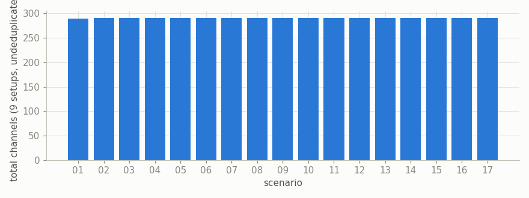
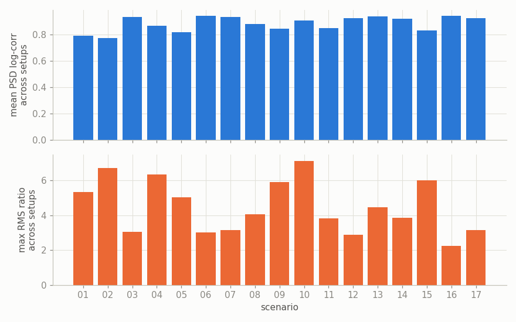
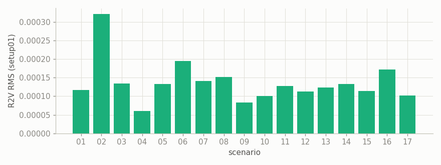
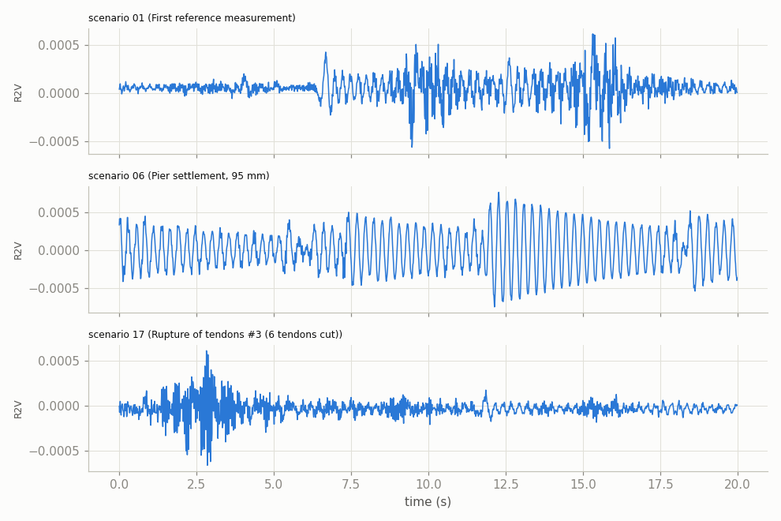
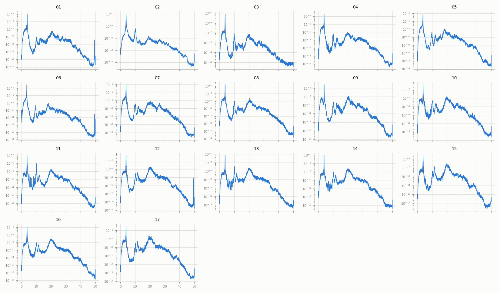
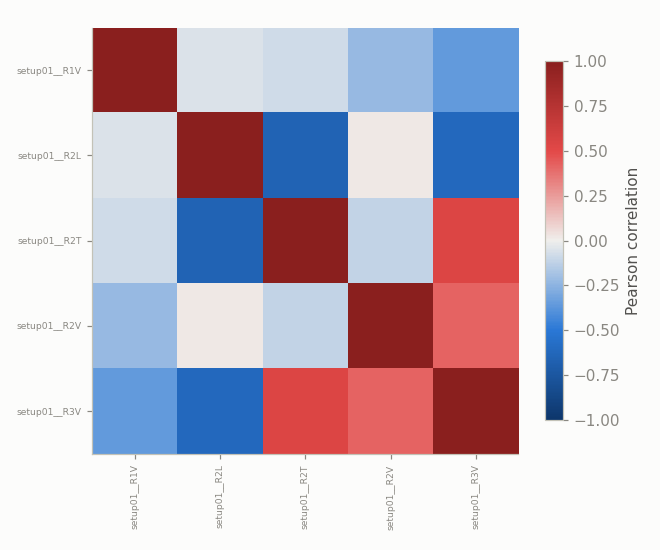

# Z24 Bridge (PDT) — Ambient Vibration Test (AVT) Exploratory Data Analysis

Z24 Bridge Progressive Damage Test (PDT) campaign, **Ambient Vibration Test (AVT)** side: the same 17 structural damage scenarios as [`reports/eda_z24.md`](eda_z24.md) (forced-vibration/FVT), but excited by traffic and wind rather than a shaker -- no driving-point channels, no controlled input. Source: `datasets/data-z24/pdt_*.zip`. **AVT uses a different roving-array sensor grid than FVT** -- zero location-channel overlap confirmed between the two campaigns' setup01 (see `src/data/z24.py`'s module docstring) -- so only the 5 reference channels (`R1V`,`R2L`,`R2T`,`R2V`,`R3V`) are common to both; see [`reports/eda_z24_comparison.md`](eda_z24_comparison.md) for the AVT-vs-FVT comparison this enables. As with FVT, there is no continuous time series or binary attack label here, and benchmark/method integration is out of scope for this report.

## Overview

- 17 scenarios, 9 ambient-vibration setups combined into each (153 source `.mat` files total).
- Sample rate: 100 Hz. Samples per scenario: 65,026-65,536 (~650-655s).
- Total channels per scenario (9 setups x ~33 channels each, not deduplicated): 289-291 -- fewer than FVT's 304-309, since AVT setups carry no `DP1V`/`DP2V` driving-point channels.
- 2 scenario(s) have an **inferred rather than confirmed** label (see Scenario notes below): 03, 17.

## Data quality

Documented sample count is 65536 (Appendix J); actual per-scenario sample count (after truncating each scenario's 9 setups to their common length) is 65536 for 13 scenarios, but shorter for scenario(s) 01, 02, 03, 07 (65530, 65530, 65026, 65410 samples respectively) -- a different (larger) set of short scenarios than FVT's (which was only 01/02), cause not documented in the source material.

Channel count varies by scenario (289-291) for the same reason as FVT -- not every setup carries every shared channel.

## Same-ambient-conditions consistency check

For FVT, the 9 setups shared a controlled shaker forcing; for AVT the "forcing" is whatever traffic and wind happened to be doing during each setup's recording -- a much weaker assumption of consistency across setups than FVT's. The same spectral-consistency test used for FVT is applied here (raw time-domain correlation is expected to be ~0 regardless, since even FVT's *controlled* excitation showed that; PSD log-correlation is the meaningful comparison):

Lowest mean spectral consistency: scenario 02 (mean PSD log-correlation 0.776). Full per-scenario numbers (compare against FVT's in `reports/eda_z24.md`):

|    |   scenario |   mean_psd_log_corr |   max_rms_ratio |
|---:|-----------:|--------------------:|----------------:|
|  0 |         01 |               0.792 |           5.327 |
|  1 |         02 |               0.776 |           6.702 |
|  2 |         03 |               0.935 |           3.061 |
|  3 |         04 |               0.867 |           6.339 |
|  4 |         05 |               0.817 |           5.039 |
|  5 |         06 |               0.943 |           3     |
|  6 |         07 |               0.936 |           3.157 |
|  7 |         08 |               0.88  |           4.074 |
|  8 |         09 |               0.846 |           5.9   |
|  9 |         10 |               0.908 |           7.122 |
| 10 |         11 |               0.852 |           3.822 |
| 11 |         12 |               0.925 |           2.876 |
| 12 |         13 |               0.938 |           4.467 |
| 13 |         14 |               0.923 |           3.861 |
| 14 |         15 |               0.831 |           5.998 |
| 15 |         16 |               0.943 |           2.232 |
| 16 |         17 |               0.926 |           3.144 |

## Vibration amplitude across scenarios

RMS amplitude of a representative shared channel (`R2V`, setup01) across all 17 scenarios:

## Time series

`R2V` (setup01), first 20s, for three contrasting scenarios:

## Frequency-domain analysis (PSD across all 17 scenarios)

`R2V` (setup01) power spectral density for every scenario:

## Correlation among shared channels

Within scenario 01, setup01: correlation among the 5 of 5 candidate shared channels present here:

## Scenario notes

|    |   scenario | label                                                       | label_confidence   | test_date             | notes                                                                                                                                                                                                                                                                                                                                                                                                                                                  |
|---:|-----------:|:------------------------------------------------------------|:-------------------|:----------------------|:-------------------------------------------------------------------------------------------------------------------------------------------------------------------------------------------------------------------------------------------------------------------------------------------------------------------------------------------------------------------------------------------------------------------------------------------------------|
|  0 |         01 | First reference measurement                                 | confirmed          | 1998-08-04/1998-08-05 | Prior to Koppigen Pier installation (undamaged baseline, original bearings). Cabling error lost signals 223,228,233,238,243 (renamed to Utzenstorf pier); DP1V lost in setups 01 & 05; force from driving point 2 (DP2) must be multiplied by a factor of 6.25.                                                                                                                                                                                        |
|  1 |         02 | Second reference measurement                                | confirmed          | 1998-08-09/1998-08-10 | After Koppigen Pier installation (new temporary support hardware installed at Koppigen pier, still undamaged).                                                                                                                                                                                                                                                                                                                                         |
|  2 |         03 | Pier settlement, 20 mm                                      | inferred           | 1998-08-11/1998-08-12 | No test report (.DOC) present in either zip for this scenario -- label and date inferred from Appendix F's deflection progression (Level 1 = -20mm) and the chronological gap between scenario 02 (09-10 Aug) and scenario 04 (13-14 Aug, 40mm). Not a document quote.                                                                                                                                                                                 |
|  3 |         04 | Pier settlement, 40 mm                                      | confirmed          | 1998-08-13/1998-08-14 | None.                                                                                                                                                                                                                                                                                                                                                                                                                                                  |
|  4 |         05 | Pier settlement, 80 mm                                      | confirmed          | 1998-08-17/1998-08-18 | AVT report only (no FVT .DOC, though fvt/*.mat data exists). "Some strange behaviour of signals 100V,105V,110V... and so forth, 200V,205V,210V... No explanation found" (quoted from the source report).                                                                                                                                                                                                                                               |
|  5 |         06 | Pier settlement, 95 mm                                      | confirmed          | 1998-08-18/1998-08-19 | Extra raw per-channel .aaa exports exist under avt/ for this scenario (out of scope here since only fvt/ was extracted).                                                                                                                                                                                                                                                                                                                               |
|  6 |         07 | Tilt of foundation                                          | confirmed          | 1998-08-19/1998-08-20 | Relative difference of 6mm at Koppigen Pier.                                                                                                                                                                                                                                                                                                                                                                                                           |
|  7 |         08 | Third reference measurement                                 | confirmed          | 1998-08-20/1998-08-21 | Reference after settlement/tilt scenarios undone (back to nominal support condition). Redundant nested avt.zip/fvt.zip duplicates of the same .mat files also exist in the archive; not extracted (see module docstring).                                                                                                                                                                                                                              |
|  8 |         09 | Spalling of concrete, 12 sq m                               | confirmed          | 1998-08-25/1998-08-26 | No measurements with sensor (KW).                                                                                                                                                                                                                                                                                                                                                                                                                      |
|  9 |         10 | Spalling of concrete, 24 sq m                               | confirmed          | 1998-08-26/1998-08-27 | "A strange behaviour in some points for an unknown reason" (source report).                                                                                                                                                                                                                                                                                                                                                                            |
| 10 |         11 | Landslide                                                   | confirmed          | 1998-08-27/1998-08-28 | None.                                                                                                                                                                                                                                                                                                                                                                                                                                                  |
| 11 |         12 | Failure of concrete hinges at abutment pier(s)              | confirmed          | 1998-08-31/1998-09-01 | None.                                                                                                                                                                                                                                                                                                                                                                                                                                                  |
| 12 |         13 | Failure of anchor heads of post-tensioning cables (1 head)  | confirmed          | 1998-09-02/1998-09-03 | During setup 08 a big drift occurred in the signal from point 107V.                                                                                                                                                                                                                                                                                                                                                                                    |
| 13 |         14 | Failure of anchor heads of post-tensioning cables (4 heads) | confirmed          | 1998-09-03/1998-09-04 | None.                                                                                                                                                                                                                                                                                                                                                                                                                                                  |
| 14 |         15 | Rupture of tendons #1                                       | confirmed          | 1998-09-03/1998-09-04 | The source AVT report's own date field is a likely copy-paste error (identical to scenario 01's date, but the doc's creation timestamp is 08.09.98). Date here is inferred from chronological position between scenario 14 (03-04 Sept) and scenario 16 (08-09 Sept), not a literal quote. No FVT .DOC present, though fvt/*.mat data exists. "Some strange behaviour of signals 100V,105V,110V and so forth... No explanation found" (source report). |
| 15 |         16 | Rupture of tendons #2 (4 tendons cut)                       | confirmed          | 1998-09-08/1998-09-09 | None.                                                                                                                                                                                                                                                                                                                                                                                                                                                  |
| 16 |         17 | Rupture of tendons #3 (6 tendons cut)                       | inferred           | 1998-09-09/1998-09-10 | The AVT and FVT source reports for this scenario disagree: AVT calls it "Rupture of tendons #2" (6 tendons), FVT calls it "Rupture of tendons #3". Since scenario 16 already used "#2" for a 4-tendon cut, "#3" (this being the 3rd cutting event) is used here as the best-effort resolution -- treat as inferred, not a clean document quote.                                                                                                        |
