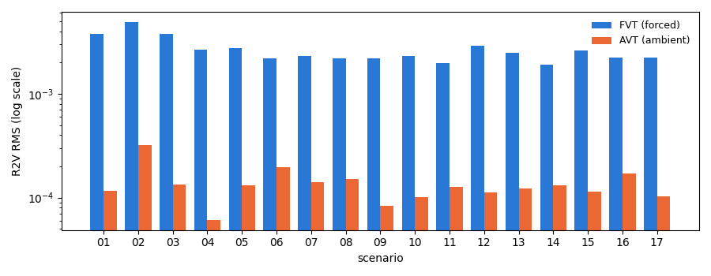
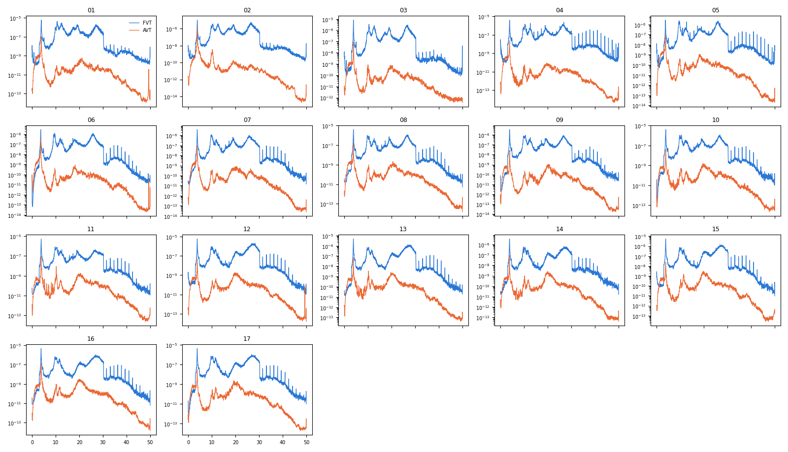
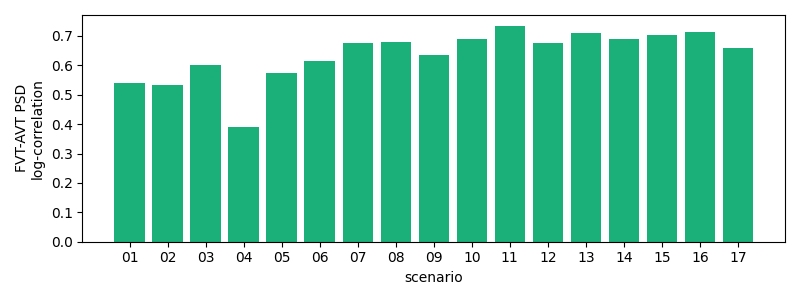

# Z24 Bridge (PDT) — Ambient (AVT) vs. Forced (FVT) Vibration Comparison

Compares the two Z24 PDT test campaigns per scenario: [`reports/eda_z24.md`](eda_z24.md) (Forced Vibration Test, shaker-driven) and [`reports/eda_z24_avt.md`](eda_z24_avt.md) (Ambient Vibration Test, traffic/wind-driven). **Scope note**: AVT and FVT use different roving-array sensor grids with zero location-channel overlap (confirmed directly from the `.mat` files -- see `src/data/z24.py`'s module docstring) -- only the 5 reference channels (`R1V`,`R2L`,`R2T`,`R2V`,`R3V`), present in nearly every setup of both campaigns, allow an apples-to-apples comparison. Everything below uses setup01's copy of these channels, consistent with the representative-channel choice in both per-campaign reports. This is not a comparison of the full ~300-column datasets.

## Amplitude: ambient vs. forced excitation

RMS amplitude of `R2V` (setup01), FVT vs. AVT, per scenario -- ambient (traffic/wind) excitation is expected to be much lower-energy than shaker-driven forced excitation:

FVT/AVT RMS ratio ranges 11.3x-43.7x across scenarios (median 20.7x) -- forced excitation is consistently and substantially higher-energy, as expected for a shaker vs. ambient traffic/wind.

## PSD shape: same structural resonances, different excitation

`R2V` (setup01) power spectral density, FVT and AVT overlaid, per scenario -- if the same structural resonances show up under both excitation types (as expected, same bridge), peaks should broadly align even though absolute power differs (per the amplitude comparison above):

## Cross-campaign spectral correlation

Log-PSD correlation between FVT's and AVT's `R2V` (setup01) per scenario -- a single number summarizing how much the resonance structure agrees despite the different excitation source (this is necessarily lower than either campaign's own cross-setup consistency, reported in the two per-campaign reports, since it's comparing across excitation types, not just across setups of the same type):

|    |   scenario |   cross_campaign_psd_log_corr |
|---:|-----------:|------------------------------:|
|  0 |         01 |                         0.541 |
|  1 |         02 |                         0.532 |
|  2 |         03 |                         0.602 |
|  3 |         04 |                         0.389 |
|  4 |         05 |                         0.574 |
|  5 |         06 |                         0.613 |
|  6 |         07 |                         0.674 |
|  7 |         08 |                         0.678 |
|  8 |         09 |                         0.635 |
|  9 |         10 |                         0.69  |
| 10 |         11 |                         0.734 |
| 11 |         12 |                         0.675 |
| 12 |         13 |                         0.709 |
| 13 |         14 |                         0.691 |
| 14 |         15 |                         0.704 |
| 15 |         16 |                         0.712 |
| 16 |         17 |                         0.659 |

## What this comparison does not cover

- The ~285-304 campaign-specific (non-reference) channels in each combined file cover non-overlapping bridge segments between AVT and FVT -- there is no shared ground truth to compare them against directly.
- AVT has no driving-point channels (`DP1V`/`DP2V`) at all -- no shaker, nothing to co-locate a sensor with.
- Sample-count and channel-count irregularities differ between the two campaigns (see each per-campaign report's Data quality section) -- this report uses setup01 specifically, which is unaffected in both.
